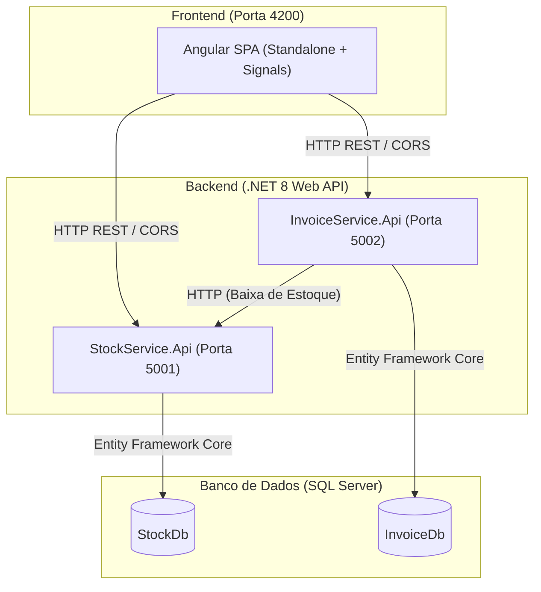

# 📦 Korp ERP - Sistema de Emissão de Notas Fiscais & Controle de Estoque

Projeto desenvolvido como parte do teste prático técnico da **Korp**, implementando uma aplicação completa para controle de estoque e emissão de notas fiscais baseada em arquitetura de microsserviços e frontend reativo em Angular.

---

## 📑 Sumário
- [Arquitetura da Solução](#-arquitetura-da-solução)
- [Funcionalidades Implementadas](#-funcionalidades-implementadas)
- [Detalhamento Técnico](#-detalhamento-técnico)
  - [Frontend (Angular)](#frontend-angular)
  - [Backend (.NET / C#)](#backend-net--c)
- [Tecnologias Utilizadas](#-tecnologias-utilizadas)
- [Como Executar o Projeto](#-como-executar-o-projeto)
  - [Pré-requisitos](#pré-requisitos)
  - [1. Configuração do Backend](#1-configuração-do-backend)
  - [2. Configuração do Frontend](#2-configuração-do-frontend)
- [Demonstração em Vídeo](#-demonstração-em-vídeo)

---

## 🏛 Arquitetura da Solução

O sistema foi concebido utilizando o padrão de **Microsserviços**, desacoplando a responsabilidade de estoque da emissão e fechamento de faturamento:



1.  **StockService (`http://localhost:5001`):** Responsável pelo cadastro de produtos, validações de unicidade de código e processamento atômico de dedução de saldo de estoque.
2.  **InvoiceService (`http://localhost:5002`):** Responsável pela emissão e listagem de notas fiscais, controle de status sequencial e integração assíncrona com o estoque no momento do fechamento.
3.  **Frontend (`http://localhost:4200`):** Interface moderna em Angular com arquitetura orientada a componentes *Standalone* e reatividade via *Signals*.

---

## ✨ Funcionalidades Implementadas

### 1. Controle de Estoque
- **Cadastro de Produtos:** Registro prévio de produtos com código, descrição e saldo inicial.
- **Validação de Negócio:** Rejeição automática de duplicidade de código de produto.
- **Listagem Reativa:** Visualização em tempo real do saldo em estoque com indicadores visuais de saldo baixo/zerado.

### 2. Gestão de Faturamento & Notas Fiscais
- **Emissão de Notas Fiscais:** Formulário para inclusão de múltiplos itens e quantidades com numeração sequencial automática.
- **Ciclo de Vida da Nota:** Criação com status inicial **Aberta** e permissão para transição para **Fechada**.
- **Fechamento e Dedução de Saldo:** Ao fechar/imprimir uma nota fiscal, o `InvoiceService` consome a API do `StockService` para efetuar a baixa das quantidades utilizadas no estoque de forma segura.
- **Tratamento de Falhas:** Caso o saldo seja insuficiente ou o serviço de estoque esteja indisponível, a operação é revertida e um feedback claro é apresentado ao usuário.

---

## 🔍 Detalhamento Técnico

Conforme solicitado na especificação técnica do projeto:

### Frontend (Angular)
- **Ciclos de Vida Utilizados:** `ngOnInit` para carregar dados essenciais da API na inicialização dos componentes.
- **Reatividade & Gerenciamento de Estado:** Utilização de **Angular Signals** (`signal()`) para garantia de renderização imediata e reatividade em modo *Zoneless*.
- **Uso de RxJS:** Consumo do `HttpClient` com manipulação de `Observables`, utilizando `.subscribe({ next, error })` para fluxos assíncronos e tratamento de exceções de rede.
- **Componentes Visuais:** Layout responsivo desenvolvido com **HTML5 semântico e SCSS**, sem dependência de bibliotecas CSS pesadas externas, garantindo alta performance e código limpo.
- **Formulários:** Uso do `FormsModule` com *two-way data binding* (`[(ngModel)]`).

### Backend (.NET / C#)
- **Framework & Runtime:** .NET 8 com ASP.NET Core Web API.
- **ORM & Persistência:** Entity Framework Core (EF Core) com abordagem *Code-First* e migrações estruturadas para o SQL Server.
- **Comunicação entre Microsserviços:** Implementação de cliente HTTP tipado (`IStockServiceClient` / `StockServiceClient`) configurado via `HttpClientFactory` com injeção de dependência.
- **Uso de LINQ:** Amplo uso de métodos LINQ (`.Select()`, `.Where()`, `.FirstOrDefaultAsync()`, `.MaxAsync()`, `.Any()`) para consultas, mapeamento de DTOs e geração incremental do número da nota.
- **Tratamento de Erros e Exceções:** 
  - Retorno semântico de HTTP Status Codes (`200 OK`, `400 Bad Request`, `404 Not Found`).
  - Tratamento de exceções de transporte (`HttpRequestException`, `SqlException`) com mensagens informativas.

---

## 🛠 Tecnologias Utilizadas

- **Linguagens & Plataformas:** C# (.NET 8), TypeScript, HTML5, SCSS
- **Frameworks:** ASP.NET Core Web API, Angular 19+
- **Banco de Dados:** Microsoft SQL Server
- **Bibliotecas:** 
  - `Microsoft.EntityFrameworkCore.SqlServer`
  - `Microsoft.EntityFrameworkCore.Tools`
  - `Swashbuckle.AspNetCore` (Swagger/OpenAPI)
  - `RxJS`

---

## 🚀 Como Executar o Projeto

### Pré-requisitos
- [.NET 8 SDK](https://dotnet.microsoft.com/download/dotnet/8.0)
- [Node.js](https://nodejs.org/) (versão 20 ou superior)
- [Angular CLI](https://angular.dev/) (`npm install -g @angular/cli`)
- [SQL Server](https://www.microsoft.com/sql-server/) (LocalDB ou SQL Express)

---

### 1. Configuração do Backend

#### a) Serviço de Estoque (`StockService.Api`)
Abra um terminal:
```bash
# Navegar até a pasta do microsserviço
cd backend/StockService.Api

# Aplicar as migrações para criar o banco StockDb
dotnet ef database update

# Executar a API (Porta 5001)
dotnet run
```

#### b) Serviço de Faturamento (`InvoiceService.Api`)
Abra um novo terminal:
``` bash
# Abra um novo terminal:

# Navegar até a pasta do microsserviço
cd backend/InvoiceService.Api

# Aplicar as migrações para criar o banco InvoiceDb
dotnet ef database update

# Executar a API (Porta 5002)
dotnet run
```
### 2. Configuração do Frontend
Abra um novo terminal:

```bash
# Navegar até a pasta do frontend
cd frontend

# Instalar as dependências
npm install

# Iniciar o servidor de desenvolvimento
ng serve
Acesse a aplicação no navegador em: http://localhost:4200
```

🎥 Demonstração em Vídeo
Link do Vídeo: https://drive.google.com/file/d/1uDRgJrGWkPnUGWZOSd2FVYo9d1UJfuMU/view?usp=sharing
